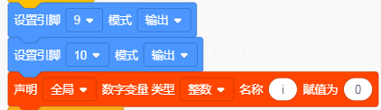
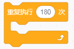
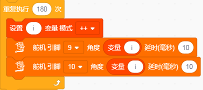
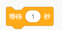
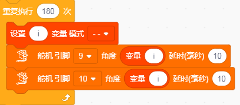

# KidsBlock

## 1. KidsBlock简介  

KidsBlock是一款友好的图形化编程平台，旨在帮助儿童和初学者通过可视化的方法学习编程。它允许用户通过拖放不同的编程模块来创建程序，避免了传统编程的复杂语法，使得编程变得更加直观和有趣。KidsBlock支持多种硬件平台，如Arduino，通过与传感器和执行器的结合，用户可以轻松构建互动项目和电子作品。这种工具不仅可以激发学生的创造力，还能提高他们的问题解决能力，使他们在学习中体验到成就感和乐趣。  

## 2. 连接图  

  

## 3. 测试代码  

1. 在事件栏拖出Arduino启动模块。  

     

2. 在引脚栏拖出两个设置引脚模块，一个设置引脚为9，模式为输出；另一个设置引脚为10，模式为输出；然后在变量栏拖出声明全局变量模块，设置变量i赋值为0。  

     

3. 在控制栏里拖出重复执行模块。  

     

4. 在控制栏里拖出可设置重复次数的重复执行模块，并设置次数为180。  

     

5. 在变量栏拖出变量i++模块；然后添加舵机模块，在左下角的添加扩展里面添加，添加完成后拖出设置两个舵机模块，一个设置引脚为9，角度为i，延时为10ms；另一个设置引脚为10，角度为i，延时为10ms。  

     

6. 在控制栏里拖出延时模块并设置为1秒。  

     

7. 在控制栏里拖出可设置重复次数的重复执行模块，并设置次数为180。  

     

8. 在变量栏拖出变量i--模块；然后再添加舵机模块，设置引脚为9，角度为i，延时为10ms；另一个设置引脚为10，角度为i，延时为10ms。  

     

9. 在控制栏里拖出延时模块并设置为1秒。  

     

## 4. 测试结果  

按照上图接好线，烧录好代码，上电后，舵机将从0度转到180度，再从180度转动到0度。

