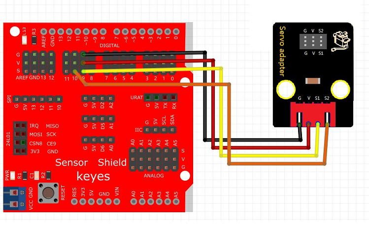
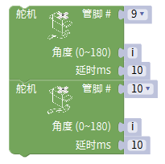

# Mixly

## 1. Mixly简介  

Mixly是一款基于图形化编程的开源软件平台，致力于为初学者和儿童提供一种直观易用的编程体验。其设计理念通过可视化模块使用户无须深入理解编程语言的复杂语法，即可创建程序。Mixly支持多种硬件平台，包括Arduino，使得用户能够通过简单的拖放操作来控制传感器、舵机和其他电子元器件。此外，Mixly具有丰富的扩展功能，可以用于创建各种有趣的项目，例如机器人、自动化控制和传感器应用。通过Mixly，用户不仅可以学习编程逻辑，还能培养创意和问题解决的能力。  

## 2. 连接图  

  

## 3. 测试代码  

1. 在控制栏拖出for循环模块，并设置i从0到180每次i加1。  

     

2. 在模块栏下里点开驱动模块，拖出两个舵机模块，一个设置管脚为9、角度为i、延时为10ms；另一个设置管脚为10、角度为i、延时为10ms。  

     

3. 在控制栏里拖出延时模块并设置为1000ms。  

     

4. 在控制栏拖出for循环模块，并设置i从180到0每次i减1。  

     

5. 在模块栏下里点开驱动模块，拖出两个舵机模块，一个设置管脚为9、角度为i、延时为10ms；另一个设置管脚为10、角度为i、延时为10ms。  

     

6. 在控制栏里拖出延时模块并设置为1000ms。  

     

## 4. 测试结果  

按照上图接好线，烧录好代码，上电后，舵机将从0度转到180度，再从180度转动到0度。

