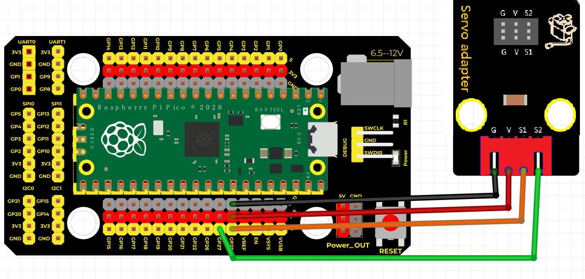

# Python


## 1. Python简介  

Python是一种广泛使用的高级编程语言，以其简洁易读的语法和丰富的库而闻名。它支持多种编程范式，包括面向对象、命令式和函数式编程，非常适合初学者和专业开发者。Python广泛应用于数据科学、人工智能、Web开发、自动化脚本、游戏开发等多个领域。其强大的标准库和活跃的社区支持，使用户能够快速开发复杂的应用程序。近年来，Python在物联网（IoT）和嵌入式系统开发中也成为了重要的编程语言，特别是与MicroPython等轻量级实现结合使用时，能够在微控制器中高效运行。  

## 2. 连接图  

  

## 3. 测试代码  

```python  
import machine  
import utime  

servo1 = machine.PWM(machine.Pin(28))  # 创建第一个舵机PWM对象，连接到引脚28  
servo2 = machine.PWM(machine.Pin(27))  # 创建第二个舵机PWM对象，连接到引脚27  

servo1.freq(50)  # 设置PWM频率为50Hz  
servo2.freq(50)  # 设置PWM频率为50Hz  

while True:  
    servo1.duty_u16(4915)  # 设置舵机为90度  
    servo2.duty_u16(4915)  
    utime.sleep(1)  # 延时1秒  

    servo1.duty_u16(8192)  # 设置舵机为180度  
    servo2.duty_u16(8192)  
    utime.sleep(1)  # 延时1秒  

    servo1.duty_u16(1638)  # 设置舵机为0度  
    servo2.duty_u16(1638)  
    utime.sleep(1)  # 延时1秒  
```  

## 4. 测试结果  

按照上图接好线，烧录好代码，上电后，舵机将从0度转到180度，再从180度转动到0度。


